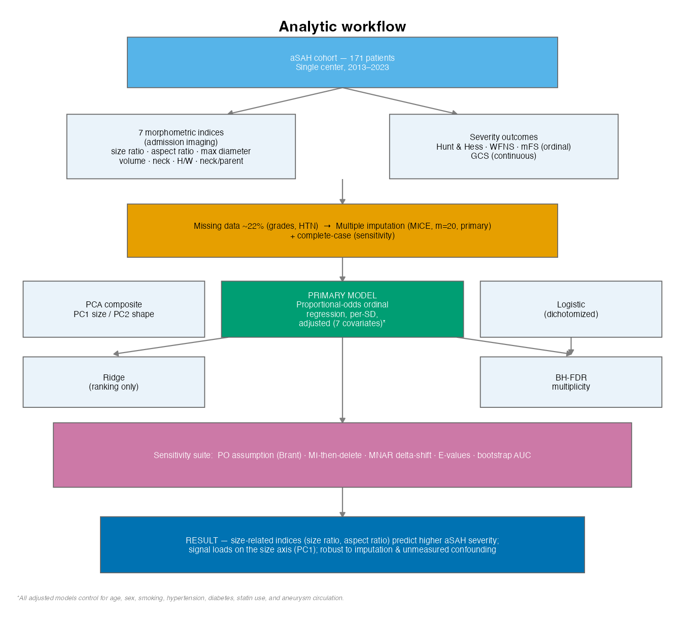

# Aneurysm Morphology and aSAH Severity — Reproducibility Package

Reproducible R pipeline for the study *"Imaging-Derived Aneurysm Morphology and
Hemorrhage Severity in Aneurysmal Subarachnoid Hemorrhage."* This package
regenerates every descriptive statistic, model, and sensitivity analysis from the
raw clinical workbook.

## Analytic workflow



*Single-center aSAH cohort → seven admission-imaging morphometric indices and four
severity outcomes → multiple imputation for ~22% missingness (complete-case
sensitivity) → primary proportional-odds ordinal regression (per-SD,
covariate-adjusted), with PCA, ridge (ranking only), and dichotomized logistic as
secondary models → Benjamini–Hochberg FDR → sensitivity suite (Brant test,
MI-then-delete, MNAR delta-shift, E-values, bootstrap-validated AUC).*

## ⚠️ Data / PHI

The raw workbook (`aSAH_Comprehensive_Data_1.1.26.xlsx`) contains **MRN, DOB, and
dates — identifiable PHI — and is NOT included in this repository** (see
`.gitignore`). The pipeline never reads those columns into the analysis frame, so
the derived `outputs/analysis_data.rds` is de-identified; it is nonetheless kept
local by default. To run the pipeline, point the pipeline at your local copy:

```bash
export ASAH_XLSX="/path/to/aSAH_Comprehensive_Data_1.1.26.xlsx"
```

## Pipeline

| Script | Purpose |
|--------|---------|
| `R/00_inspect.R` | Diagnostic: reports how each raw column is coded (run once). |
| `R/01_clean.R` | Builds the analysis dataset; **self-tests against the published Table 1**. |
| `R/02_analysis.R` | Corrected + extended models → `outputs/analysis_log.txt`. |
| `R/03_rwe_checks.R` | MICE bias audit, MNAR sensitivity, E-values → `outputs/rwe_audit_log.txt`. |
| `R/05_tables.R` | Publication tables (CSV + `outputs/tables/TABLES.docx`). |
| `R/04_figures.R` | Figures 1–3 (300-dpi TIFF + PDF) → `figures/`. |
| `R/06_method_figure.R` | Figure 4, analytic-workflow schematic → `figures/`. |
| `R/run_all.R` | Runs the whole pipeline end to end. |

Run everything:

```bash
export ASAH_XLSX="/path/to/aSAH_Comprehensive_Data_1.1.26.xlsx"
cd R && Rscript run_all.R
```

Outputs: `outputs/analysis_log.txt`, `outputs/rwe_audit_log.txt`,
`outputs/tables/` (CSV + Word), `figures/` (Fig 1–4 TIFF + PDF, legends).

**Note on Table 1:** the pipeline reproduces the manuscript's Table 1 counts
exactly, including female sex (113). The workbook stores sex as a mix of text
(`Female`/`Male`) and numeric codes, where `0` = Female and `1` = Male.

## Documentation

- **`docs/METHODS_AND_EQUATIONS.md`** — formal model equations (proportional-odds
  ordinal regression, MICE + Rubin's rules, logistic, PCA, ridge, FDR, bootstrap
  validation) and the exact covariate adjustment set.
- **`docs/CODE_WALKTHROUGH.md`** — line-by-line teaching walkthrough of every
  script.

## What differs from the submitted manuscript (and why)

| Manuscript | This pipeline | Reason |
|---|---|---|
| Linear regression on ordinal grades | Proportional-odds **ordinal** regression | Reviewer #2; grades are ordinal |
| Complete-case only (~40% dropped) | **Multiple imputation** (MICE, m=20) + CC sensitivity | Reviewer #1; 22% missing |
| Raw-scale coefficients | **Per-SD standardized** predictors | Comparable, interpretable ORs |
| "ASPECTS ratio" | **Aspect ratio** (dome height / neck width) | Corrects terminology error |
| Ridge *p*-values reported | Ridge for ranking; bootstrap inference | Ridge Wald *p* are invalid |
| Only PC1 tested | **PC1 (size) + PC2 (shape) + PC3** | Separates size vs shape signal |
| Bleb unused | Bleb tested as predictor + effect modifier | It is in the dataset |
| — | **E-values, MNAR delta, MI-then-delete** | Quantify residual bias |

## Which RWE methods apply here

This is a **cross-sectional** association study (continuous morphologic exposure →
admission severity), with **no treatment comparison and no time-to-event**.
Therefore propensity-score matching/weighting, target-trial emulation, IPCW,
marginal structural models, and survival methods **do not apply**. The RWE tools
that *do* apply — and are implemented in `03_rwe_checks.R` — are multiple-imputation
diagnostics, MNAR pattern-mixture sensitivity, missingness-mechanism testing, and
**E-values** for unmeasured confounding. Reporting follows STROBE.

## Environment

R (≥4.2) with: `readxl`, `MASS`, `ordinal`, `mice`, `brant`, `pROC`, `EValue`,
`glmnet`, `rms`, `boot`, `ggplot2`, `patchwork`. Exact versions are pinned in
`renv.lock` (generated under R 4.5.1); restore with `renv::restore()`.
