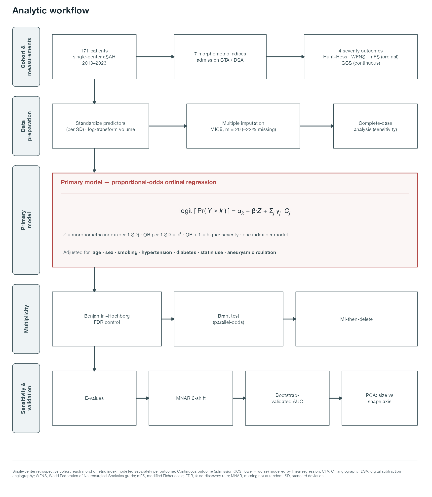
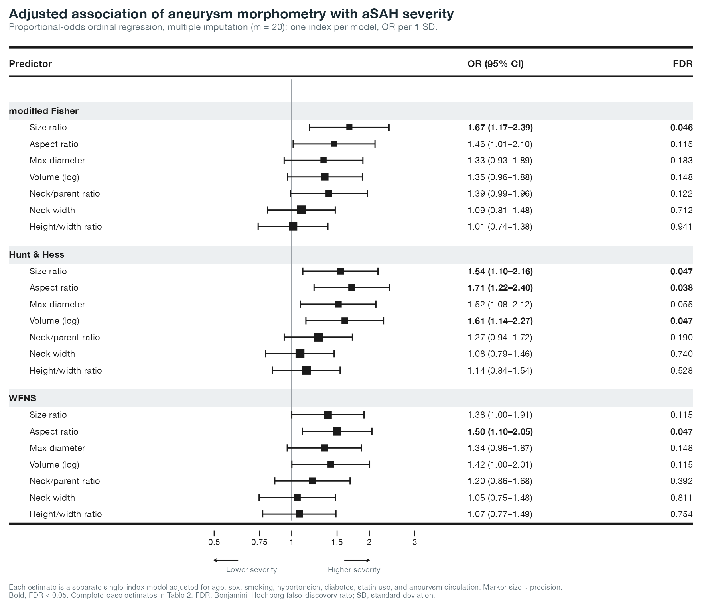

# Aneurysm Morphology and aSAH Severity — Reproducibility Package

Reproducible R pipeline for the study *"Imaging-Derived Aneurysm Size Ratio and
Aspect Ratio Are Associated With Hemorrhage Severity and Early Neurological Status
in Aneurysmal Subarachnoid Hemorrhage."* This package regenerates every
descriptive statistic, model, sensitivity analysis, table, and figure from the raw
clinical workbook.

## Analytic workflow (Figure 1)



*Single-center aSAH cohort → seven admission-imaging morphometric indices and four
severity outcomes (Hunt–Hess, WFNS, modified Fisher [ordinal]; GCS [continuous]) →
multiple imputation for ~22% missingness (complete-case sensitivity) → primary
proportional-odds ordinal regression (per-SD, adjusted for age, sex, smoking,
hypertension, diabetes, statin use, and aneurysm circulation), with PCA and
dichotomized logistic as secondary models → Benjamini–Hochberg FDR → sensitivity
suite (Brant test, MI-then-delete, MNAR delta-shift, E-values, bootstrap-validated
AUC). The primary-model equation and full adjustment set are shown in the figure.*

## Key result (Figure 2)



*Adjusted per-SD odds ratios (proportional-odds ordinal regression, multiple
imputation) for each morphometric index against the three ordinal severity scales.
Size ratio, aspect ratio, volume, and — for Hunt–Hess — maximal diameter survive
false-discovery-rate correction (bold rows). Complete-case estimates are in Table 2.*

## ⚠️ Data / PHI

The raw workbook (`aSAH_Comprehensive_Data_1.1.26.xlsx`) contains **MRN, DOB, and
dates — identifiable PHI — and is NOT included in this repository** (see
`.gitignore`). The pipeline never reads those columns into the analysis frame, so
the derived `outputs/analysis_data.rds` is de-identified; it is nonetheless kept
local by default. To run the pipeline, point it at your local copy:

```bash
export ASAH_XLSX="/path/to/aSAH_Comprehensive_Data_1.1.26.xlsx"
```

## Pipeline

| Script | Purpose |
|--------|---------|
| `R/00_inspect.R` | Diagnostic: reports how each raw column is coded (run once). |
| `R/01_clean.R` | Builds the analysis dataset; **self-tests against the published Table 1**. |
| `R/02_analysis.R` | Corrected + extended models → `outputs/analysis_log.txt`. |
| `R/03_rwe_checks.R` | MICE bias audit, MNAR sensitivity, E-values → `outputs/rwe_audit_log.txt`. |
| `R/05_tables.R` | Table CSVs + Markdown/Word (`outputs/tables/TABLES.docx`). |
| `R/07_tables_gt.R` | Publication tables typeset with **gt** (PNG + PDF + HTML), JAMA house style. |
| `R/04_figures.R` | Figures 2–4 (300-dpi TIFF + vector PDF + PNG) → `figures/`. |
| `R/06_method_figure.R` | Figure 1, analytic-workflow schematic → `figures/`. |
| `R/_journal_theme.R` | Shared JAMA design system (palette, Helvetica theme, `save_fig()`); sourced by the figure scripts. |
| `R/run_all.R` | Runs the whole pipeline end to end. |

Run everything:

```bash
export ASAH_XLSX="/path/to/aSAH_Comprehensive_Data_1.1.26.xlsx"
cd R && Rscript run_all.R
```

## Figures & tables

All figures follow one **JAMA house style** (defined in `R/_journal_theme.R`):
near-monochrome slate with a single brick-red accent reserved for FDR-significant /
robustness results, Helvetica, forests as square markers with capped whiskers.

| Figure | Content |
|--------|---------|
| **Figure 1** | Analytic-workflow schematic (methods): pipeline + proportional-odds model equation and adjustment set. |
| **Figure 2** | Table-with-forest of adjusted per-SD ordinal ORs (multiple imputation) by outcome. |
| **Figure 3** | PCA — loading biplot (size vs shape axes), scree, and component → severity. |
| **Figure 4** | Sensitivity — E-values, high-grade HH by size-ratio tertile, MNAR robustness. |

Each figure is written as a composite (`figures/FigureN_*.tiff` + `.pdf`) **and** as
individual panels (`figures/individual/Figure3a.tiff`, `Figure4b.tiff`, …) in case a
journal requests panels as separate files. Legends are in `figures/FIGURE_LEGENDS.md`.
Tables 1–3 are rendered both as editable Word (`outputs/tables/TABLES.docx`) and as
typeset `gt` graphics (`outputs/tables/Table1.pdf`, …).

**Note on Table 1:** the pipeline reproduces the manuscript's Table 1 counts exactly,
including female sex (113). The workbook stores sex as a mix of text (`Female`/`Male`)
and numeric codes, where `0` = Female and `1` = Male.

## Documentation

- **`docs/METHODS_AND_EQUATIONS.md`** — formal model equations (proportional-odds
  ordinal regression, MICE + Rubin's rules, logistic, PCA, FDR, bootstrap
  validation) and the exact covariate adjustment set.
- **`docs/CODE_WALKTHROUGH.md`** — line-by-line teaching walkthrough of every script.

## What differs from the original manuscript (and why)

| Original manuscript | This pipeline | Reason |
|---|---|---|
| Linear regression on ordinal grades | Proportional-odds **ordinal** regression | Reviewer #2; grades are ordinal |
| Complete-case only (~40% dropped) | **Multiple imputation** (MICE, m=20) + CC sensitivity | Reviewer #1; ~22% missing |
| Raw-scale coefficients | **Per-SD standardized** predictors | Comparable, interpretable ORs |
| "ASPECTS ratio" | **Aspect ratio** (dome height / neck width) | Corrects terminology error |
| Ridge *p*-values reported | Ridge for ranking only | Ridge Wald *p* are invalid |
| Only PC1 tested (dichotomized) | **PC1 (size) + PC2 (shape)** under the ordinal model | Separates size vs shape signal |
| — | **E-values, MNAR delta, MI-then-delete** | Quantify residual bias |

The primary per-index results and the PCA/sensitivity models all use the **same
seven-covariate adjustment set**, so the figures, tables, and manuscript text are
mutually consistent.

## Which RWE methods apply here

This is a **cross-sectional** association study (continuous morphologic exposure →
admission severity), with **no treatment comparison and no time-to-event**.
Therefore propensity-score matching/weighting, target-trial emulation, IPCW,
marginal structural models, and survival methods **do not apply**. The RWE tools
that *do* apply — implemented in `03_rwe_checks.R` — are multiple-imputation
diagnostics, MNAR pattern-mixture sensitivity, missingness-mechanism testing, and
**E-values** for unmeasured confounding. Reporting follows STROBE.

## Environment

R (≥ 4.2) with, for analysis: `readxl`, `MASS`, `ordinal`, `mice`, `brant`, `pROC`,
`EValue`, `glmnet`, `rms`, `boot`; and for figures/tables: `ggplot2`, `patchwork`,
`ggrepel`, `ggtext`, `ragg`, `systemfonts`, `ggsci`, `scales`, `gt` (PNG/PDF export
via `webshot2` + `chromote`, which require a local Chrome/Chromium). Versions are
pinned in `renv.lock` (generated under R 4.5.1); restore with `renv::restore()`.
